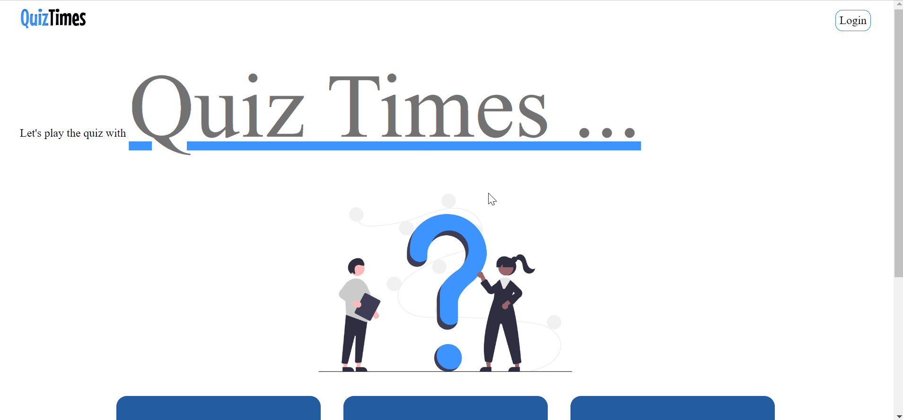

## "Quiz Times" is the quiz app that test your knowledge on the category given below. 
- Computer Science Quiz, 
- Mathematics Quiz, 
- Mythology Quiz

## Tech stack used
 
 

## Demo preview

## Features
- Select the quiz category.
- Each correct answer awards you +1 point and each incorrect answer awards you 0 point.
- Once the choice made then it cannot be change.
- Upon completion of quiz result will be shown to you.
